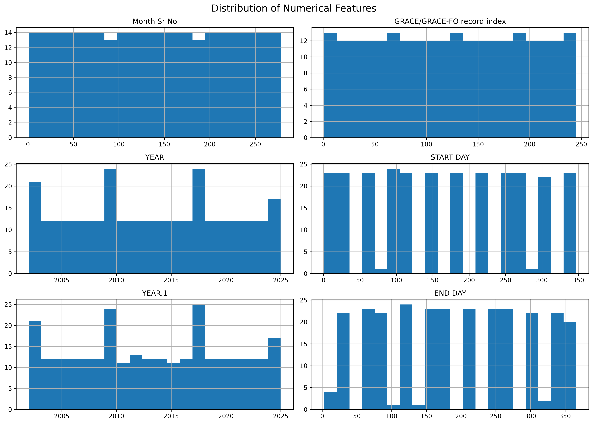
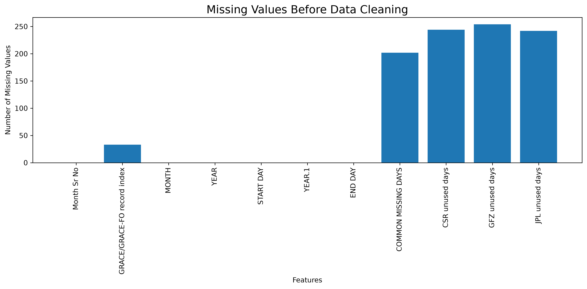
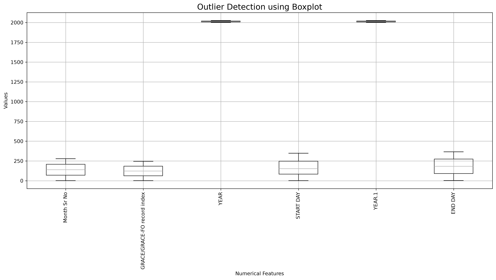
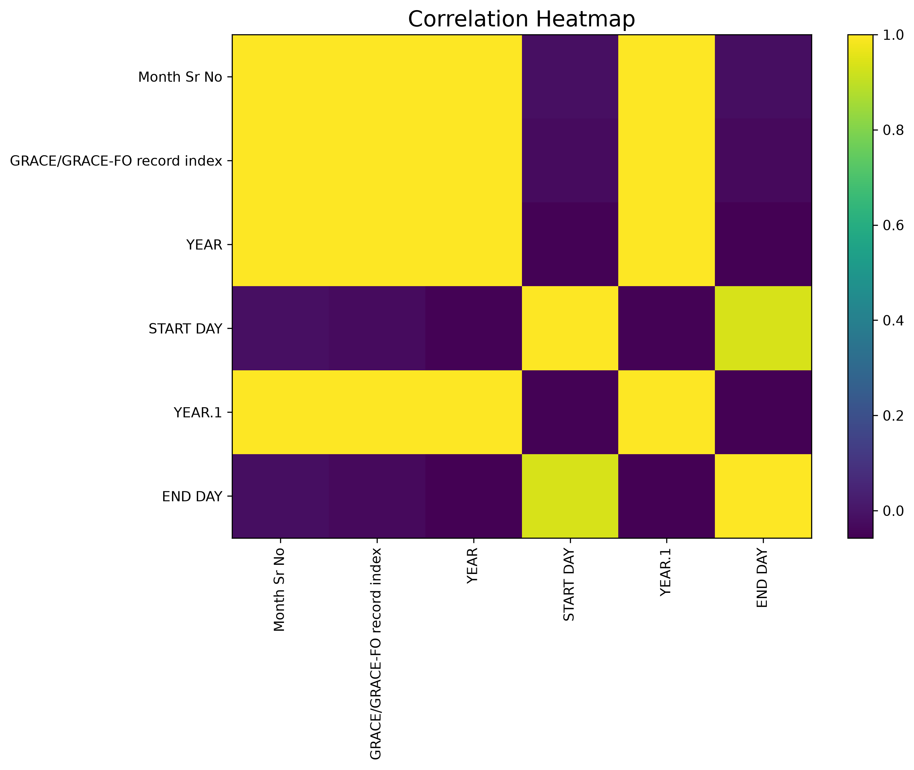

# LAB02 - Data Preprocessing

## Overview

This project focuses on the Data Preprocessing process using the NASA JPL GRACE / GRACE-FO Monthly Land Water Storage Anomalies dataset.

The purpose of this lab is to explore, inspect, clean, transform, and prepare data before using it for Machine Learning.

---

## Objectives

- Understand the principles and importance of Data Preprocessing before applying Machine Learning techniques.
- Analyze data quality by identifying Missing Values, Duplicate Data, Outliers, and Inconsistent Data.
- Apply appropriate Data Cleaning and Data Transformation techniques.
- Apply Label Encoding and One-Hot Encoding to prepare categorical data.
- Use Python and related libraries to perform Data Preprocessing.
- Present the results and source code through GitHub.

---

## Dataset

**Dataset:** NASA JPL GRACE / GRACE-FO Monthly Land Water Storage Anomalies

**Dataset File:**

`GRACE_GRACE-FO_Months_RL06.csv`

The dataset contains monthly information related to the GRACE and GRACE-FO satellite missions.

---

## Dataset Exploration

The dataset was initially explored to understand its structure and quality.

The following information was examined:

- Dataset Preview
- Dataset Shape
- Data Types
- Summary Statistics
- Missing Values
- Duplicate Records
- Class Distribution

---

## Data Visualization

### 1. Distribution of Numerical Features

A Histogram was used to examine the distribution of numerical features in the dataset.

This visualization helps identify the shape of the data distribution, skewness, unusual values, and differences in numerical ranges.

**Data Handling Approach:**

If numerical features have significantly different ranges, Feature Scaling or Normalization can be considered before applying Machine Learning algorithms.

For skewed data or data containing outliers, the Median may be more appropriate than the Mean when filling Missing Values.

---

### 2. Missing Values

This graph shows the number of Missing Values in each feature before Data Cleaning.

**Data Handling Approach:**

- Numerical features with Missing Values are filled using the Median.
- Categorical features with Missing Values are filled using the Mode.
- Missing Values are checked again after Data Cleaning to confirm that the issue has been resolved.

Example:

`Numerical Data → Median`

`Categorical Data → Mode`

---

### 3. Outlier Detection

A Boxplot was used to identify possible Outliers in numerical features.

Outliers are values that are significantly different from most observations in the dataset.

**Data Handling Approach:**

Outliers should not be removed automatically.

Each Outlier should first be examined to determine whether it represents:

- Incorrect data
- Data entry errors
- Measurement errors
- Valid extreme observations

If an Outlier is caused by incorrect data, it may be corrected or removed.

If it represents a valid observation, it may be retained. Techniques such as IQR, Transformation, Scaling, or Normalization can also be considered to reduce its impact on Machine Learning models.

---

### 4. Correlation Heatmap

The Correlation Heatmap shows the relationships between numerical features.

Correlation values range from `-1` to `1`.

- A value close to `1` indicates a strong positive relationship.
- A value close to `-1` indicates a strong negative relationship.
- A value close to `0` indicates a weak or no linear relationship.

**Data Handling Approach:**

If two or more features have a very high correlation, Feature Selection can be considered to reduce redundant information.

This can help reduce Multicollinearity and simplify the dataset before developing a Machine Learning model.

---

## Data Cleaning

The following Data Cleaning processes were performed:

### Missing Value Handling

Missing Values were identified using:

`isnull().sum()`

The following methods were applied:

- Numerical Data → Median
- Categorical Data → Mode

### Duplicate Removal

Duplicate records were identified and removed using:

`drop_duplicates()`

The number of duplicate records was checked before and after cleaning.

### Inconsistent Data Correction

Text-based features were cleaned by removing unnecessary spaces using:

`str.strip()`

This helps prevent logically identical values from being treated as different categories.

### Data Type Conversion

Columns containing date or time information were identified and converted into the appropriate DateTime format when applicable.

---

## Mean vs Median

Mean and Median values were compared for numerical features.

**Mean**

The Mean represents the average value of the data but can be strongly affected by extreme values or Outliers.

**Median**

The Median represents the middle value of the dataset and is less affected by Outliers.

For this preprocessing process, the Median was used to fill Missing Values in numerical features because it is generally more robust when Outliers are present.

---

## Feature Engineering

### Label Encoding

Label Encoding converts categorical text values into numerical values.

Example:

Before:

`GRACE`

`GRACE-FO`

After:

`0`

`1`

The encoded dataset is saved as:

`GRACE_Label_Encoded.csv`

---

### One-Hot Encoding

One-Hot Encoding converts categorical values into separate binary features.

Example:

Before:

`Mission = GRACE`

After:

`Mission_GRACE = 1`

`Mission_GRACE-FO = 0`

The encoded dataset is saved as:

`GRACE_OneHot_Encoded.csv`

---

## Output Files

The preprocessing program generates the following datasets:

- `GRACE_Cleaned_Data.csv` - Cleaned dataset
- `GRACE_Label_Encoded.csv` - Dataset after Label Encoding
- `GRACE_OneHot_Encoded.csv` - Dataset after One-Hot Encoding

The following visualization files are generated:

- `01_histogram.png` - Distribution of numerical features
- `02_missing_values.png` - Missing Values analysis
- `03_outlier_boxplot.png` - Outlier detection
- `04_correlation_heatmap.png` - Correlation analysis

---

## Project Structure

    LAB02/
    │
    ├── Data_preprocessing.py
    ├── GRACE_GRACE-FO_Months_RL06.csv
    ├── GRACE_Cleaned_Data.csv
    ├── GRACE_Label_Encoded.csv
    ├── GRACE_OneHot_Encoded.csv
    │
    ├── 01_histogram.png
    ├── 02_missing_values.png
    ├── 03_outlier_boxplot.png
    ├── 04_correlation_heatmap.png
    │
    └── README.md

---

## Technologies Used

- Python
- Pandas
- NumPy
- Matplotlib
- Scikit-learn
- Visual Studio Code
- GitHub

---

## How to Run

Install the required Python libraries:

    pip install pandas numpy matplotlib scikit-learn

Run the Python program:

    python Data_preprocessing.py

After running the program, the cleaned datasets and visualization images will be generated automatically.

---

## Conclusion

This lab demonstrates the main steps of Data Preprocessing, including Dataset Exploration, Missing Value Handling, Duplicate Removal, Inconsistent Data Correction, Data Type Conversion, Outlier Detection, and Data Encoding.

The preprocessing process improves data quality and prepares the dataset for further analysis and Machine Learning applications.
