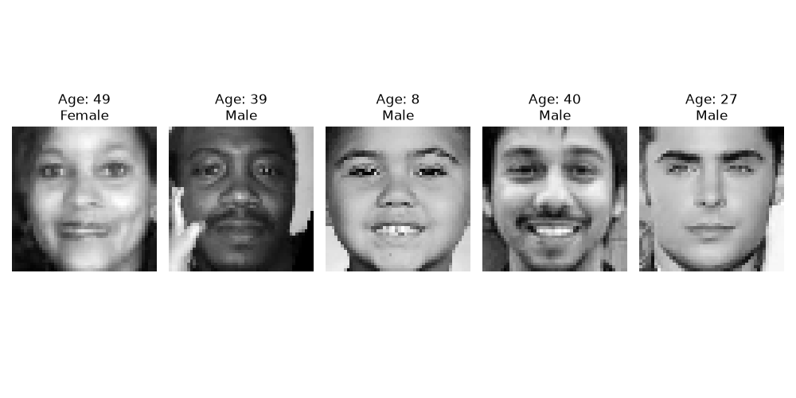
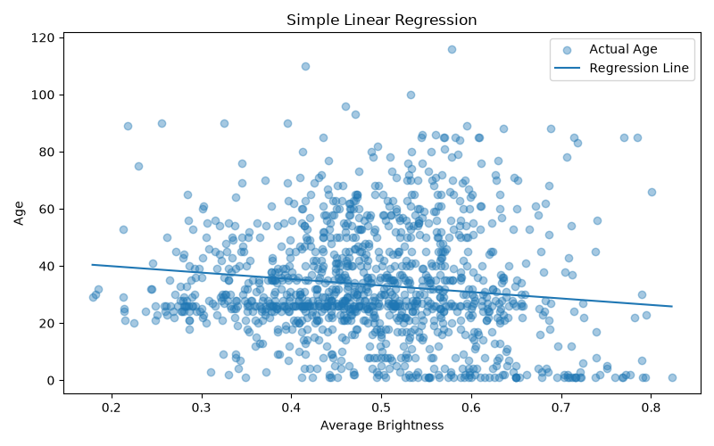
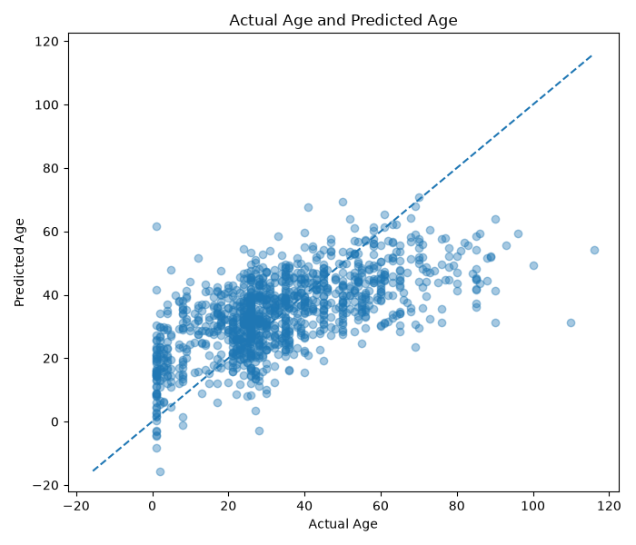
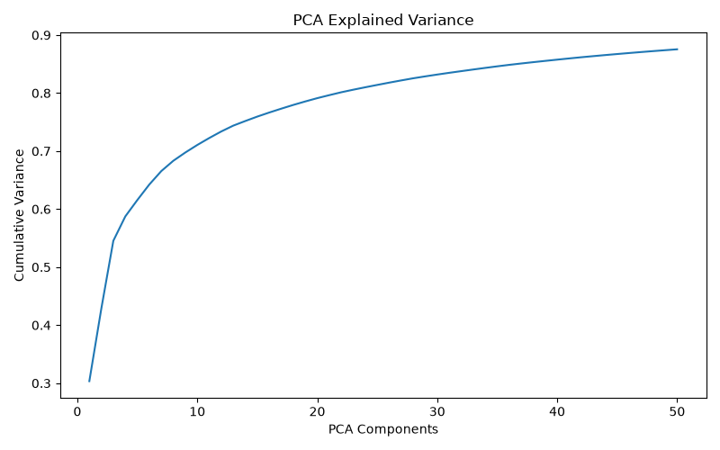
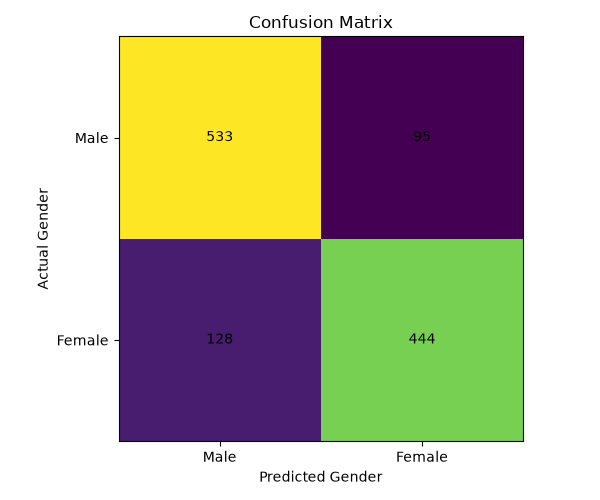
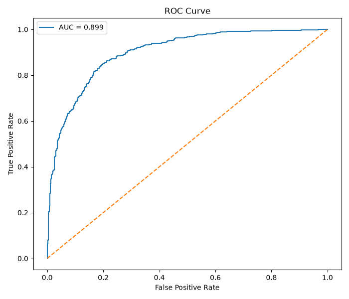

# LAB03 : Regression & Classification

## Machine Learning Laboratory 3

โปรเจกต์นี้เป็นการทดลองใช้งาน Supervised Learning สำหรับงาน Regression และ Classification โดยใช้ข้อมูลภาพใบหน้าเพื่อทำนายอายุและจำแนกเพศด้วยภาษา Python และไลบรารี Scikit-learn

---

## Objectives

- ศึกษาหลักการของ Regression และ Classification
- ทดลองใช้ Simple Linear Regression สำหรับการทำนายอายุ
- ทดลองใช้ Multiple Linear Regression ร่วมกับ PCA
- ทดลองใช้ Logistic Regression สำหรับการจำแนกเพศ
- ลดจำนวน Feature ด้วย Principal Component Analysis (PCA)
- ประเมินประสิทธิภาพของโมเดลด้วยตัวชี้วัดที่เหมาะสม

---

## Dataset

ใช้ชุดข้อมูล **Age Gender Dataset**

ข้อมูลประกอบด้วย

- Age
- Gender
- Facial image pixel values ขนาด 48 × 48

แหล่งข้อมูลจาก Kaggle

https://www.kaggle.com/datasets/jangedoo/utkface-new

> หมายเหตุ: ไฟล์ `age_gender.csv` ไม่ได้รวมอยู่ใน Repository ผู้ใช้งานต้องดาวน์โหลด Dataset และนำไฟล์ `age_gender.csv` มาไว้ในโฟลเดอร์ `LAB03` ก่อนรันโปรแกรม

---

## Technologies

- Python
- Visual Studio Code
- NumPy
- Pandas
- Matplotlib
- Scikit-learn

---

## Machine Learning Models

### Regression

- Simple Linear Regression
- Multiple Linear Regression

ใช้สำหรับทำนายอายุจากข้อมูลภาพใบหน้า

### Classification

- Logistic Regression

ใช้สำหรับจำแนกเพศเป็น

- Male
- Female

### Feature Reduction

- Principal Component Analysis (PCA)

ใช้เพื่อลดจำนวน Feature ของข้อมูลภาพก่อนนำไปสร้างโมเดล

---

## Evaluation Metrics

### Regression

- Mean Absolute Error (MAE)
- Root Mean Square Error (RMSE)
- R² Score

### Classification

- Accuracy
- Precision
- Recall
- F1-score
- Classification Report
- Confusion Matrix
- ROC Curve
- Area Under Curve (AUC)

---

## Project Structure

```text
LAB03/
├── LAB3.py
├── README.md
├── requirements.txt
├── .gitignore
└── images/
    ├── sample_images.png
    ├── simple_linear_regression.png
    ├── multiple_linear_regression.png
    ├── pca_explained_variance.png
    ├── confusion_matrix.png
    └── roc_curve.png
```

---

## Installation

ติดตั้ง Library ที่จำเป็นด้วยคำสั่ง

```bash
pip install -r requirements.txt
```

---

## Run the Program

รันโปรแกรมด้วยคำสั่ง

```bash
python LAB3.py
```

---

## Program Workflow

1. โหลดข้อมูลจากไฟล์ `age_gender.csv`
2. ตรวจสอบข้อมูลและลบข้อมูลที่ไม่สมบูรณ์
3. แปลงข้อมูล Pixels ให้เป็นข้อมูลตัวเลข
4. ปรับค่า Pixel ให้อยู่ระหว่าง 0 ถึง 1
5. แบ่งข้อมูลเป็น Training Data และ Testing Data
6. สร้างโมเดล Simple Linear Regression
7. ลดจำนวน Feature ด้วย PCA
8. สร้างโมเดล Multiple Linear Regression
9. สร้างโมเดล Logistic Regression
10. ประเมินผลลัพธ์ของแต่ละโมเดล
11. บันทึกกราฟลงในโฟลเดอร์ `images`

---

# Results

## Sample Images



## Simple Linear Regression



## Multiple Linear Regression



## PCA Explained Variance



## Confusion Matrix



## ROC Curve



---

## Conclusion

จากการทดลองสามารถนำเทคนิค Regression มาใช้ทำนายอายุ และใช้ Classification สำหรับจำแนกเพศจากข้อมูลภาพใบหน้าได้ นอกจากนี้ PCA ยังช่วยลดจำนวน Feature ของข้อมูล ทำให้โมเดลทำงานได้รวดเร็วขึ้นและลดความซับซ้อนของข้อมูล

ผลลัพธ์ที่ได้สามารถประเมินด้วยค่า MAE, RMSE, R² Score, Accuracy, Precision, Recall, F1-score และ AUC พร้อมแสดงผลเป็นกราฟเพื่อช่วยในการวิเคราะห์ประสิทธิภาพของโมเดล
