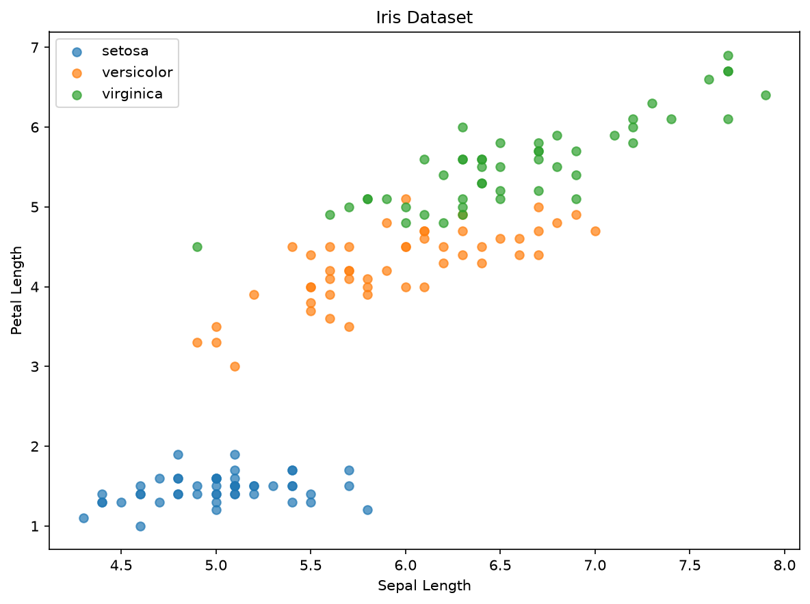
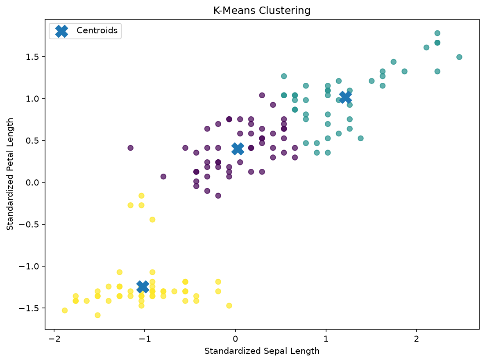
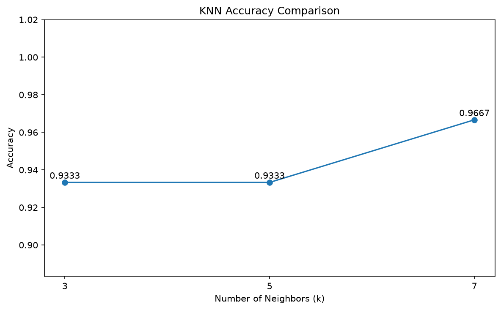
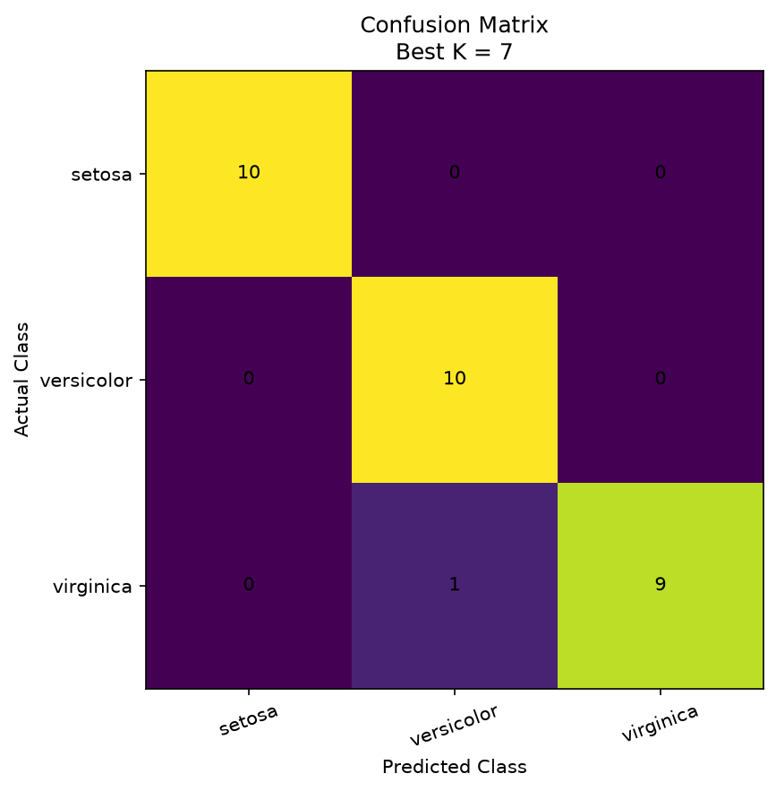

# LAB04 : K-Nearest Neighbors (KNN)

## Machine Learning Laboratory 4

โปรเจกต์นี้เป็นการศึกษาการทำงานของอัลกอริทึม **K-Nearest Neighbors (KNN)** สำหรับการจำแนกข้อมูล (Classification) โดยใช้ชุดข้อมูล **Iris Dataset** พร้อมทั้งทดลองเปรียบเทียบประสิทธิภาพของโมเดลด้วยค่า **k = 3, 5 และ 7** เพื่อหาค่าที่เหมาะสมที่สุด

---

## Objectives

- ศึกษาหลักการทำงานของ K-Nearest Neighbors (KNN)
- สำรวจและเตรียมข้อมูลก่อนสร้างโมเดล
- ทดลองทำ Clustering และ Classification
- ปรับข้อมูลด้วย StandardScaler ก่อนสร้างโมเดล
- เปรียบเทียบผลลัพธ์ของค่า k ที่แตกต่างกัน
- เลือกค่า k ที่ให้ Accuracy สูงที่สุด

---

## Dataset

ใช้ชุดข้อมูล **Iris Dataset**

ข้อมูลประกอบด้วยคุณลักษณะของดอกไอริส 4 ค่า ได้แก่

- Sepal Length
- Sepal Width
- Petal Length
- Petal Width

จำแนกออกเป็น 3 ชนิด

- Setosa
- Versicolor
- Virginica

จำนวนข้อมูลทั้งหมด **150 ตัวอย่าง**

---

## Development Tools

- Python
- Visual Studio Code
- NumPy
- Pandas
- Matplotlib
- Scikit-learn

---

## Data Preprocessing

ก่อนสร้างโมเดลได้ดำเนินการดังนี้

- โหลดข้อมูลจากไฟล์ CSV
- ตรวจสอบข้อมูลเบื้องต้น
- ตรวจสอบ Missing Values
- ลบข้อมูลซ้ำ (Duplicate Data)
- แบ่งข้อมูลเป็น Training Set และ Testing Set
- ปรับข้อมูลด้วย StandardScaler

---

## Machine Learning Algorithms

### Clustering

ใช้ **K-Means Clustering** เพื่อทดลองจัดกลุ่มข้อมูล

### Classification

ใช้ **K-Nearest Neighbors (KNN)**

ทดลองค่าเพื่อนบ้าน

- k = 3
- k = 5
- k = 7

---

## Evaluation Metric

ใช้ตัวชี้วัดดังนี้

- Accuracy
- Classification Report
- Confusion Matrix

---

## Project Structure

```text
LAB04
│
├── LAB4.py
├── iris.csv
├── README.md
├── requirements.txt
├── .gitignore
│
└── images
    ├── iris_dataset.png
    ├── kmeans_clustering.png
    ├── knn_accuracy.png
    └── confusion_matrix.png
```

---

## Installation

ติดตั้ง Library ที่จำเป็น

```bash
pip install -r requirements.txt
```

---

## Run

รันโปรแกรมด้วยคำสั่ง

```bash
python LAB4.py
```

---

## Program Workflow

1. โหลดข้อมูล Iris Dataset
2. สำรวจข้อมูลและตรวจสอบ Missing Values
3. ทำความสะอาดข้อมูล
4. แบ่งข้อมูลเป็น Training และ Testing
5. Standardize ข้อมูล
6. ทดลอง K-Means Clustering
7. สร้างโมเดล KNN
8. ทดลองค่า k = 3, 5 และ 7
9. เปรียบเทียบ Accuracy
10. เลือกค่า k ที่ดีที่สุด
11. แสดงผลลัพธ์และบันทึกกราฟ

---

# Results

## Iris Dataset



---

## K-Means Clustering



---

## KNN Accuracy Comparison



---

## Confusion Matrix



---

## Experimental Results

จากการทดลองพบว่า

- ค่า Accuracy ของแต่ละค่า k มีความแตกต่างกัน
- ค่า k ที่เหมาะสมที่สุด คือค่าที่ให้ Accuracy สูงที่สุดบนชุดข้อมูลทดสอบ
- การ Standardize ข้อมูลช่วยให้ KNN สามารถคำนวณระยะห่างของข้อมูลได้มีประสิทธิภาพมากขึ้น
- การเลือกค่า k ที่เหมาะสมช่วยลดปัญหา Overfitting และ Underfitting

---

## Conclusion

การทดลองครั้งนี้แสดงให้เห็นว่าอัลกอริทึม K-Nearest Neighbors สามารถนำมาใช้จำแนกชนิดของดอกไอริสได้อย่างมีประสิทธิภาพ โดยการทดลองเปรียบเทียบค่า k หลายค่า ทำให้สามารถเลือกโมเดลที่ให้ผลลัพธ์ดีที่สุดได้ นอกจากนี้การทำ Data Preprocessing และ Standardization ยังเป็นขั้นตอนสำคัญที่ช่วยเพิ่มประสิทธิภาพของโมเดลก่อนการเรียนรู้
