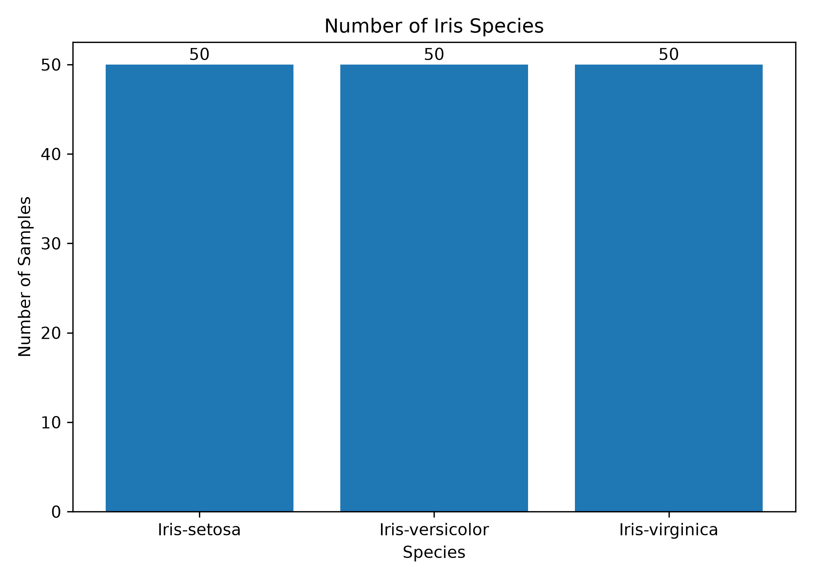
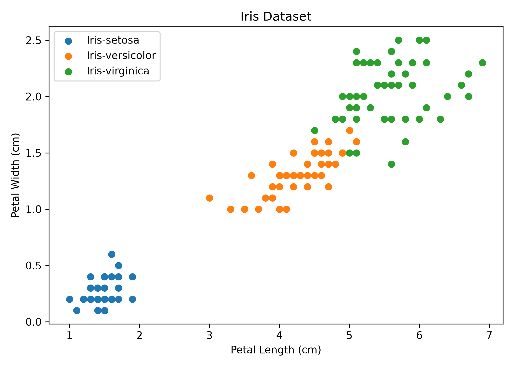
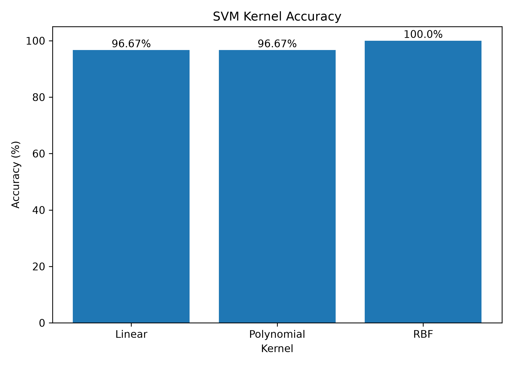

# LAB05 - Support Vector Machine (SVM)

## Support Vector Machine and SVM Applications

This laboratory applies the **Support Vector Machine (SVM)** algorithm to classify the Iris dataset and compare the performance of different SVM kernel functions.

ใบงานนี้เป็นการทดลองใช้งาน Support Vector Machine (SVM) สำหรับการจำแนกข้อมูล โดยใช้ Iris Dataset เป็นชุดข้อมูลในการทดลอง

---

## Objectives

The objectives of this laboratory are:

* Apply Support Vector Machine (SVM) for classification.
* Select and explore the Iris dataset.
* Preprocess and standardize the input features before training.
* Train SVM models using three different kernels.
* Compare the performance of Linear, Polynomial, and RBF kernels.
* Evaluate each model using Accuracy.
* Display prediction results from the testing dataset.

---

## Dataset

This laboratory uses the **Iris Dataset** for classification.

The dataset contains **150 samples** and four input features:

| Feature         | Description                 |
| --------------- | --------------------------- |
| `SepalLengthCm` | Sepal length in centimeters |
| `SepalWidthCm`  | Sepal width in centimeters  |
| `PetalLengthCm` | Petal length in centimeters |
| `PetalWidthCm`  | Petal width in centimeters  |

The target variable is `Species`, which contains three classes:

* Iris-setosa
* Iris-versicolor
* Iris-virginica

---

## Project Structure

```text
LAB05/
├── images/
│   ├── svm_accuracy.png
│   ├── species_count.png
│   └── iris_scatter.png
├── .gitignore
├── Iris.csv
├── main.py
├── README.md
└── requirements.txt
```

---

## Workflow

```text
Iris Dataset
      |
      v
Load Dataset
      |
      v
Explore Dataset
      |
      v
Check Missing Values
      |
      v
Select Features and Target
      |
      v
Train / Test Split
      |
      v
Standardization
      |
      v
+------------+------------+------------+
|   Linear   | Polynomial |    RBF     |
+------------+------------+------------+
      |            |            |
      v            v            v
    Train        Train        Train
      |            |            |
      v            v            v
   Predict      Predict      Predict
      |            |            |
      v            v            v
  Accuracy     Accuracy     Accuracy
       \           |           /
        \          |          /
         +---------+---------+
                   |
                   v
             Compare Results
```

---

## Data Exploration

Before training the SVM models, the dataset is explored by checking:

* First five rows of the dataset
* Number of rows and columns
* Missing values
* Number of samples in each species

### Iris Species Distribution

The graph below shows the number of samples for each Iris species.



---

## Data Visualization

The scatter plot shows the relationship between **Petal Length** and **Petal Width** for the three Iris species.



กราฟใช้สำหรับดูการกระจายตัวของข้อมูล Iris แต่ละ Species จาก Petal Length และ Petal Width

---

## Data Preprocessing

The dataset is divided into:

* **80% Training Data**
* **20% Testing Data**

The four input features are standardized using `StandardScaler` before training the SVM models.

Standardization is performed to scale the input features before they are used for model training.

---

## SVM Models

Three SVM kernel functions are used in this experiment:

1. **Linear Kernel**
2. **Polynomial Kernel**
3. **RBF Kernel**

Each model is trained and tested using the same dataset split for comparison.

---

## Accuracy Results

The performance of each SVM model is evaluated using **Accuracy**.

| SVM Kernel | Accuracy |
| ---------- | -------: |
| Linear     |   96.67% |
| Polynomial |   96.67% |
| RBF        |  100.00% |

### SVM Kernel Accuracy Comparison



The experimental results show that the **RBF Kernel achieved the highest accuracy at 100.00%**.

---

## Prediction Results

The program predicts the Iris species from the testing dataset using all three SVM models.

The prediction results contain:

* `Actual` - Actual species
* `Linear` - Prediction from Linear Kernel
* `Polynomial` - Prediction from Polynomial Kernel
* `RBF` - Prediction from RBF Kernel

Example output:

```text
===== Prediction Results =====

Actual              Linear              Polynomial          RBF
Iris-versicolor     Iris-versicolor     Iris-versicolor     Iris-versicolor
Iris-setosa         Iris-setosa         Iris-setosa         Iris-setosa
Iris-virginica      Iris-virginica      Iris-virginica      Iris-virginica
```

---

## Libraries

The following Python libraries are used:

* pandas
* matplotlib
* scikit-learn

Install the required libraries using:

```bash
pip install -r requirements.txt
```

---

## Running the Program

Open the terminal in the `LAB05` directory and run:

```bash
python main.py
```

The program will display:

* Dataset information
* Missing values
* Training and testing data size
* Accuracy scores for each SVM kernel
* Best performing kernel
* Prediction results
* Result graphs

The generated graphs are automatically saved in the `images` directory.

---

## Conclusion

In this laboratory, Support Vector Machine was applied to classify the Iris dataset using three different kernel functions: **Linear, Polynomial, and RBF**.

The input features were standardized before training, and each model was evaluated using Accuracy.

The experimental results were:

* **Linear Kernel: 96.67%**
* **Polynomial Kernel: 96.67%**
* **RBF Kernel: 100.00%**

The **RBF Kernel achieved the highest accuracy** for the dataset and train/test split used in this experiment.

**สรุปผลการทดลอง:** จากการเปรียบเทียบ SVM ทั้ง 3 Kernel พบว่า RBF Kernel ให้ค่า Accuracy สูงที่สุดที่ 100.00% ส่วน Linear และ Polynomial ให้ค่า Accuracy เท่ากันที่ 96.67% แสดงให้เห็นว่าการเลือก Kernel ที่เหมาะสมมีผลต่อประสิทธิภาพในการจำแนกข้อมูล

---

## Files

* `Iris.csv` - Dataset used in this experiment
* `main.py` - Main Python program
* `requirements.txt` - Required Python libraries
* `images/` - Graphs generated from the experiment

---

**LAB05 - Support Vector Machine (SVM)**
