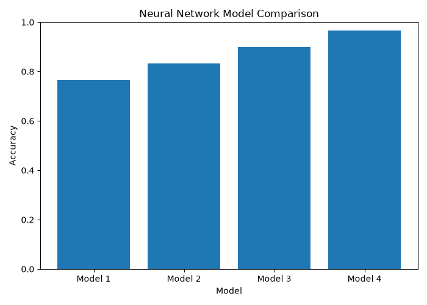
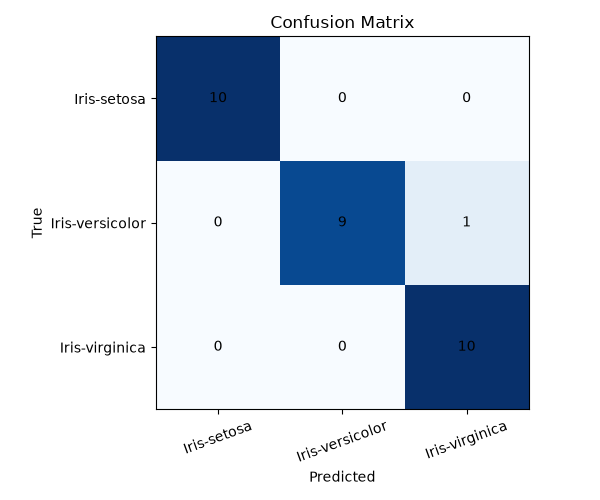
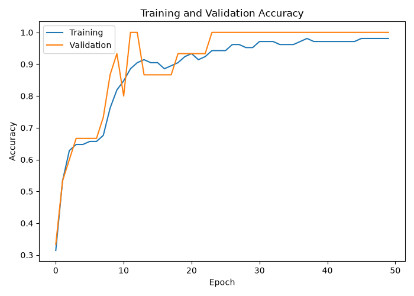
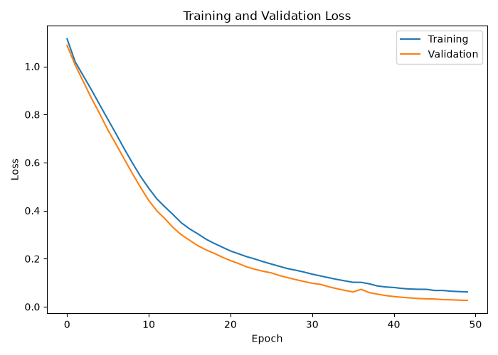

# LAB06 - Neural Network and Its Application

## Introduction

This laboratory is an experiment on using a **Neural Network (NN)** for data classification.

Neural Network can be understood as a model that allows a computer to learn patterns from examples. Instead of manually defining every rule, we provide the model with data and the correct answers. The model then adjusts itself during training so that it can make predictions when it receives new data.

ในการทดลองนี้ ผมเลือกใช้ **Iris Dataset** ซึ่งเป็นข้อมูลเกี่ยวกับลักษณะของดอก Iris โดยจะนำข้อมูลขนาดของส่วนต่าง ๆ ของดอกไม้มาให้ Neural Network เรียนรู้ และให้ Model ทำนายว่าดอกไม้แต่ละตัวอย่างเป็น Iris สายพันธุ์ใด

The main purpose of this experiment is not only to create a Neural Network, but also to compare different model configurations and observe how changing the number of **Epochs, Hidden Layers, and Neurons** affects the classification result.

---

# Objectives

The objectives of this laboratory are:

1. To understand the basic concept of Neural Networks.
2. To understand how data is prepared before training a model.
3. To apply a Neural Network to a classification problem.
4. To train Neural Networks using different numbers of epochs.
5. To compare different numbers of hidden layers and neurons.
6. To evaluate the models using accuracy.
7. To observe Training and Validation Accuracy/Loss.
8. To use the trained model to predict new data.

กล่าวโดยง่าย จุดประสงค์ของ LAB นี้คือการทดลอง **“สอนคอมพิวเตอร์ให้จำแนกชนิดของดอก Iris จากข้อมูลตัวอย่าง”** และทดลองเปลี่ยนรูปแบบของ Neural Network เพื่อดูว่าแบบใดให้ผลการจำแนกที่ดีที่สุด

---

# Dataset

## What is the Iris Dataset?

The dataset used in this experiment is the **Iris Species Dataset**.

Iris Dataset contains measurements of Iris flowers. Each row represents one flower sample, and each sample contains measurements that describe the flower.

ข้อมูลที่ใช้ในการจำแนกมีทั้งหมด 4 Features ได้แก่:

| Feature | Meaning |
|---|---|
| Sepal Length | ความยาวของกลีบเลี้ยง |
| Sepal Width | ความกว้างของกลีบเลี้ยง |
| Petal Length | ความยาวของกลีบดอก |
| Petal Width | ความกว้างของกลีบดอก |

For example, the data can be understood as:

```text
Sepal Length
Sepal Width
Petal Length
Petal Width
       |
       v
Neural Network
       |
       v
Predicted Iris Species
```

The Neural Network uses these four measurements to predict the species of the flower.

---

## Classes

The target of this experiment is called:

```text
Species
```

There are three possible classes:

```text
Iris-setosa
Iris-versicolor
Iris-virginica
```

ดังนั้นปัญหานี้จึงเป็น **Classification Problem** เพราะเราต้องการให้คอมพิวเตอร์เลือกคำตอบว่าข้อมูลหนึ่งตัวอย่างควรอยู่ใน Class ใดจากทั้งหมด 3 Classes

---

## Dataset Source

The dataset used in this laboratory was obtained from:

**Iris Species Dataset - Kaggle**

https://www.kaggle.com/datasets/uciml/iris

The dataset file used in this project is:

```text
Iris.csv
```

---

# How Does the Experiment Work?

Before looking at the source code, the complete experiment can be understood from the following workflow:

```text
Iris Dataset
      |
      v
Read the Data
      |
      v
Prepare the Data
      |
      v
Split the Data
      |
      v
Standardize the Features
      |
      v
Create Neural Network
      |
      v
Train the Model
      |
      v
Test the Model
      |
      v
Compare Results
      |
      v
Select Best Model
      |
      v
Use Model for Prediction
```

อธิบายแบบง่าย ๆ คือ

```text
เตรียมข้อมูล
    ↓
นำตัวอย่างให้ Model เรียนรู้
    ↓
ให้ Model ทดลองทำนายข้อมูลที่ไม่เคยเห็น
    ↓
ตรวจว่าทายถูกกี่ตัว
    ↓
เปรียบเทียบ Model หลายรูปแบบ
    ↓
เลือก Model ที่ให้ผลดีที่สุด
```

---

# Step 1: Data Preprocessing

Before the dataset can be used to train the Neural Network, the data must be prepared.

The program performs the following steps:

1. Load data from `Iris.csv`
2. Remove unnecessary data
3. Select the input features
4. Select the target
5. Convert text labels into numbers

The input features are:

```text
SepalLengthCm
SepalWidthCm
PetalLengthCm
PetalWidthCm
```

The target is:

```text
Species
```

---

## Why Remove the Id Column?

The original dataset contains an `Id` column.

For example:

```text
Id = 1
Id = 2
Id = 3
...
```

This number is only used to identify each row. It does not describe the physical characteristics of the flower.

Therefore, the `Id` column is removed before training.

พูดง่าย ๆ คือ หมายเลขลำดับของดอกไม้ไม่ได้ช่วยให้ Model รู้ว่าดอกไม้นั้นเป็นสายพันธุ์อะไร จึงไม่จำเป็นต้องนำไปใช้ในการเรียนรู้

---

## Label Encoding

The Species values are originally stored as text:

```text
Iris-setosa
Iris-versicolor
Iris-virginica
```

Before training, these labels are converted into numerical values using `LabelEncoder`.

Conceptually, the result is similar to:

```text
Iris-setosa      -> 0
Iris-versicolor  -> 1
Iris-virginica   -> 2
```

ขั้นตอนนี้ทำให้คำตอบอยู่ในรูปแบบตัวเลขที่สามารถนำไปใช้ในการ Train Neural Network ได้

---

# Step 2: Splitting the Dataset

We should not use all data for training because we also need some data to test whether the model can correctly predict samples that were not used during training.

Therefore, the dataset is divided into three parts:

| Dataset | Ratio | Purpose |
|---|---:|---|
| Training Set | 70% | Used to teach the model |
| Validation Set | 10% | Used to observe the model during training |
| Testing Set | 20% | Used to evaluate the trained model |

### Simple Explanation

สามารถเปรียบเทียบได้กับการเรียนหนังสือ:

- **Training Set** = แบบฝึกหัดที่ใช้เรียน
- **Validation Set** = แบบฝึกหัดสำหรับตรวจสอบระหว่างเรียน
- **Testing Set** = ข้อสอบที่ใช้วัดผลหลังเรียน

If the model performs well on the testing data, it means that the model can classify data that it did not directly learn from during training.

The experiment also uses:

```text
random_state = 42
```

to make the data splitting reproducible, and uses:

```text
stratify
```

to help maintain the proportion of each Iris class when splitting the dataset.

---

# Step 3: Feature Standardization

The four features have different numerical values.

Before training, the input features are standardized using:

```python
StandardScaler()
```

The purpose is to transform the features into a similar scale before they are passed to the Neural Network.

สามารถเข้าใจง่าย ๆ ว่าเป็นการ **“ปรับสเกลข้อมูลให้ใกล้เคียงกัน”** เพื่อไม่ให้ Feature ใด Feature หนึ่งมีอิทธิพลเพียงเพราะค่าตัวเลขของมันมีขนาดแตกต่างจาก Feature อื่น

The scaler is fitted using only the Training Set and then applied to the Training, Validation, and Testing Sets.

---

# Step 4: Building the Neural Network

The Neural Network is created using **TensorFlow / Keras**.

A simple Neural Network can be viewed as:

```text
Input Data
    |
    v
Input Layer
    |
    v
Hidden Layer(s)
    |
    v
Output Layer
    |
    v
Prediction
```

The input consists of four flower measurements:

```text
Sepal Length
Sepal Width
Petal Length
Petal Width
```

The output contains three possible classes:

```text
Iris-setosa
Iris-versicolor
Iris-virginica
```

---

## What is a Neuron?

A **Neuron** is a small processing unit inside the Neural Network.

Each neuron receives information, performs a calculation, and passes the result to the next layer.

For example:

```text
Input
  |
  v
[ Neuron ]
  |
  v
Output
```

A layer can contain multiple neurons:

```text
Input
  |
  +----> Neuron
  |
  +----> Neuron
  |
  +----> Neuron
  |
  +----> Neuron
```

จำนวน Neurons จึงเป็นหนึ่งในสิ่งที่สามารถปรับเปลี่ยนเพื่อทดลองประสิทธิภาพของ Neural Network ได้

---

## What is a Hidden Layer?

A **Hidden Layer** is a layer between the input and output of the Neural Network.

For example:

```text
Input Layer
     |
     v
Hidden Layer
     |
     v
Output Layer
```

If more hidden layers are added:

```text
Input
  |
  v
Hidden Layer 1
  |
  v
Hidden Layer 2
  |
  v
Output
```

Increasing hidden layers allows the model to learn more complex relationships, but a larger network does not always mean better results.

---

# Step 5: Activation Functions

The hidden layers use:

```text
ReLU
```

ReLU is an activation function that helps the Neural Network learn non-linear patterns in the data.

The output layer uses:

```text
Softmax
```

Softmax is suitable for this experiment because the model needs to choose between three possible classes.

Conceptually, the output might look like:

```text
Iris-setosa      = 0.05
Iris-versicolor  = 0.90
Iris-virginica   = 0.05
```

The highest value is `0.90`, so the model predicts:

```text
Iris-versicolor
```

The model is compiled using:

```text
Optimizer : Adam
Loss      : Sparse Categorical Crossentropy
Metric    : Accuracy
```

---

# Step 6: Neural Network Configurations

Instead of using only one Neural Network, this experiment compares four configurations.

| Model | Hidden Layers / Neurons | Epochs |
|---|---|---:|
| Model 1 | [8] | 20 |
| Model 2 | [8] | 50 |
| Model 3 | [16, 8] | 50 |
| Model 4 | [32, 16, 8] | 50 |

---

## What is an Epoch?

An **Epoch** means one complete training cycle through the Training Dataset.

For example:

```text
Epoch 1
Model learns from all training samples once

Epoch 2
Model learns from all training samples again

Epoch 3
Model learns again
...
```

ดังนั้นถ้ากำหนด:

```text
epochs = 50
```

หมายความว่า Model จะเรียนรู้จาก Training Dataset ทั้งหมดจำนวน 50 รอบ

การเพิ่ม Epochs ทำให้ Model มีโอกาสเรียนรู้เพิ่มขึ้น แต่ถ้า Train มากเกินไป Model อาจจดจำ Training Data มากเกินไปและเกิด **Overfitting**

---

# Step 7: Comparing the Models

### Model 1 vs Model 2

```text
Model 1
Hidden Layers = [8]
Epochs = 20

Model 2
Hidden Layers = [8]
Epochs = 50
```

Both models have the same architecture.

The only major difference is the number of epochs.

ดังนั้น Model 1 และ Model 2 ใช้สำหรับศึกษาว่า **การเพิ่มจำนวนรอบในการ Train จาก 20 เป็น 50 รอบส่งผลต่อ Accuracy อย่างไร**

---

### Model 2 vs Model 3

```text
Model 2
Hidden Layers = [8]

Model 3
Hidden Layers = [16, 8]
```

Both models use 50 epochs.

This comparison focuses on the effect of increasing the number of hidden layers and neurons.

---

### Model 3 vs Model 4

```text
Model 3 = [16, 8]

Model 4 = [32, 16, 8]
```

Model 4 has a larger Neural Network.

The purpose is to observe whether increasing network complexity actually improves classification performance.

จุดที่ต้องการสังเกตคือ **Neural Network ที่ใหญ่กว่าไม่ได้หมายความว่าจะให้ผลดีกว่าเสมอไป** จึงจำเป็นต้องทดลองและเปรียบเทียบผลจริง

---

# Step 8: Model Evaluation

After training, each model is tested using the Testing Set.

The main evaluation metric is:

```text
Accuracy
```

Accuracy represents how many predictions are correct compared with the total number of test samples.

For example:

```text
Correct Predictions = 27
Total Test Samples  = 30

Accuracy = 27 / 30
         = 0.90
         = 90%
```

The program compares the accuracy of all four configurations.

The result format is:

```text
Model 1 | Layers: [8]         | Epochs: 20 | Accuracy: ...
Model 2 | Layers: [8]         | Epochs: 50 | Accuracy: ...
Model 3 | Layers: [16, 8]     | Epochs: 50 | Accuracy: ...
Model 4 | Layers: [32, 16, 8] | Epochs: 50 | Accuracy: ...
```

The model with the highest testing accuracy is selected as the:

```text
Best Model
```

> The actual accuracy values are generated when the program is executed and may vary slightly between training runs.

---

# Results and Graphs

The program generates several graphs to make the results easier to understand.

---

## 1. Model Accuracy Comparison



This graph compares the Accuracy of all four Neural Network configurations.

### How to Read This Graph

```text
Higher Accuracy
      =
More Correct Predictions
```

กราฟนี้ใช้ตอบคำถามหลักว่า:

**“จาก Neural Network ทั้ง 4 แบบ แบบใดสามารถจำแนก Iris Dataset ได้ดีที่สุด?”**

It also helps compare whether increasing epochs or increasing the number of neurons and hidden layers improves the model.

---

## 2. Confusion Matrix



A Confusion Matrix compares:

```text
Actual Class
     vs
Predicted Class
```

For example:

```text
Actual     = Iris-setosa
Prediction = Iris-setosa
```

means the prediction is correct.

But:

```text
Actual     = Iris-versicolor
Prediction = Iris-virginica
```

means the model classified the sample incorrectly.

ดังนั้น Confusion Matrix ช่วยให้เราเห็นรายละเอียดมากกว่า Accuracy เพราะสามารถดูได้ว่า **Model มักจำแนก Class ใดผิดเป็น Class ใด**

---

## 3. Training and Validation Accuracy



This graph shows how Accuracy changes during each training epoch.

There are two important lines:

```text
Training Accuracy
Validation Accuracy
```

### How to Read This Graph

If both values increase together:

```text
Training Accuracy   ↑
Validation Accuracy ↑
```

the model is generally learning useful patterns.

However, if:

```text
Training Accuracy   ↑↑↑
Validation Accuracy ----
```

the model may be learning the Training Data too specifically.

This situation can be related to:

```text
Overfitting
```

หรืออธิบายง่าย ๆ คือ Model **“จำข้อมูลที่ใช้ฝึกได้ดีเกินไป แต่เมื่อเจอข้อมูลที่ไม่เคยเห็นกลับทำได้ไม่ดีเท่าเดิม”**

---

## 4. Training and Validation Loss



**Loss** represents how far the model prediction is from the expected result during training.

Generally:

```text
Lower Loss = Better
```

During training, we normally expect:

```text
Training Loss ↓
```

If Training Loss decreases but Validation Loss begins to increase:

```text
Training Loss   ↓↓↓
Validation Loss ↓ then ↑
```

it may indicate that the model is beginning to overfit.

ดังนั้นกราฟ Accuracy และ Loss ควรนำมาพิจารณาร่วมกัน ไม่ควรดูเฉพาะ Accuracy สุดท้ายเพียงค่าเดียว

---

# Prediction

After comparing all configurations, the model with the highest testing accuracy is selected as the Best Model.

The model is saved as:

```text
best_model.keras
```

The saved model can then be loaded by:

```text
test_nn.py
```

to perform predictions.

Example:

```text
Sample 1

Actual     : Iris-setosa
Predicted  : Iris-setosa
Confidence : 98.50 %
```

The meaning is:

```text
Actual
= The correct answer from the dataset

Predicted
= The answer predicted by the Neural Network

Confidence
= How confident the model is about its prediction
```

ส่วนนี้ทำให้สามารถดูผลการทำงานของ Model เป็นรายตัวอย่างได้ง่ายขึ้น ไม่ได้ดูเพียง Accuracy รวมเท่านั้น

---

# Project Structure

The project is separated into multiple files so that each file has a clear responsibility.

```text
LAB06/
│
├── Iris.csv
├── data_loader.py
├── preprocessing.py
├── split_data.py
├── nn_model.py
├── evaluate.py
├── main.py
├── test_nn.py
├── README.md
│
└── outputs/
    ├── model_comparison.png
    ├── confusion_matrix.png
    ├── training_accuracy.png
    ├── training_loss.png
    └── best_model.keras
```

| File | Description |
|---|---|
| `Iris.csv` | Stores the Iris Dataset |
| `data_loader.py` | Loads the dataset |
| `preprocessing.py` | Prepares input features and target labels |
| `split_data.py` | Splits data into Training, Validation, and Testing Sets |
| `nn_model.py` | Creates and trains the Neural Network |
| `evaluate.py` | Calculates Accuracy and creates graphs |
| `main.py` | Controls the complete experiment |
| `test_nn.py` | Loads the Best Model and performs predictions |
| `outputs/` | Stores graphs and the trained model |

การแยกไฟล์ในลักษณะนี้ช่วยให้แต่ละส่วนของโปรแกรมมีหน้าที่ชัดเจน และสามารถแก้ไขหรือทดสอบแต่ละส่วนได้ง่ายขึ้น

---

# How to Run

## 1. Install Required Libraries

Before running the project, install the required Python libraries:

```bash
pip install tensorflow pandas numpy scikit-learn matplotlib
```

---

## 2. Run the Main Program

Run:

```bash
python main.py
```

The program will automatically perform the following process:

```text
Load Iris Dataset
        ↓
Prepare Data
        ↓
Split Dataset
        ↓
Standardize Features
        ↓
Create Neural Networks
        ↓
Train 4 Models
        ↓
Calculate Accuracy
        ↓
Compare Models
        ↓
Select Best Model
        ↓
Generate Graphs
        ↓
Save Best Model
```

The generated results are stored in:

```text
outputs/
```

---

## 3. Test the Best Model

After `main.py` finishes, run:

```bash
python test_nn.py
```

The program will load:

```text
outputs/best_model.keras
```

and use it to perform predictions on the Testing Dataset.

---

# Discussion

The main point of this experiment is to understand that creating a Neural Network is not only about making the network as large as possible.

The experiment starts with a simple model containing one hidden layer and then gradually increases the number of epochs, neurons, and hidden layers.

This makes it possible to compare:

```text
Number of Epochs
        +
Number of Neurons
        +
Number of Hidden Layers
        ↓
Model Performance
```

จากการออกแบบการทดลองนี้ สามารถศึกษาผลของแต่ละปัจจัยได้ชัดเจนขึ้น เช่น Model 1 และ Model 2 มีโครงสร้างเหมือนกัน แต่จำนวน Epochs ต่างกัน จึงสามารถใช้เปรียบเทียบผลจากจำนวนรอบการ Train ได้

ส่วน Model 2, Model 3 และ Model 4 ใช้จำนวน Epochs เท่ากัน แต่เพิ่มความซับซ้อนของ Neural Network ทำให้สามารถสังเกตผลของ Hidden Layers และ Neurons ได้

Model performance should not be evaluated using only one value.

Therefore, this experiment considers:

- Testing Accuracy
- Model Comparison
- Confusion Matrix
- Training Accuracy
- Validation Accuracy
- Training Loss
- Validation Loss
- Prediction Results

การดูผลหลายส่วนร่วมกันช่วยให้เข้าใจได้ว่า Model ไม่เพียงแค่ “ทายถูกกี่เปอร์เซ็นต์” แต่ยังสามารถดูได้ว่า Model เรียนรู้อย่างไร มีแนวโน้ม Overfitting หรือไม่ และมักทำนาย Class ใดผิด

---

# Conclusion

In this laboratory, I applied a Neural Network to classify the Iris Dataset into three species:

```text
Iris-setosa
Iris-versicolor
Iris-virginica
```

The experiment starts from preparing the dataset and continues through the complete Neural Network workflow:

```text
Data
 ↓
Preprocessing
 ↓
Training
 ↓
Testing
 ↓
Evaluation
 ↓
Prediction
```

Four different Neural Network configurations were tested by changing the number of **Epochs, Hidden Layers, and Neurons**.

The models were evaluated using Accuracy and additional graphs such as Confusion Matrix, Training/Validation Accuracy, and Training/Validation Loss.

Finally, the model with the highest Testing Accuracy is selected and saved for future predictions.

จาก LAB นี้ทำให้เข้าใจกระบวนการทำ Neural Network ได้ชัดเจนขึ้นตั้งแต่ต้นจนจบ และเห็นว่าการสร้าง Model ที่ดีไม่ได้หมายถึงการเพิ่มจำนวน Layer หรือ Neurons ให้มากที่สุด แต่ควรทดลองหลาย Configuration และนำผลที่ได้มาเปรียบเทียบก่อนเลือก Model ที่เหมาะสม

---

# References

1. **Iris Species Dataset - Kaggle**  
   Dataset used in this laboratory.  
   https://www.kaggle.com/datasets/uciml/iris
